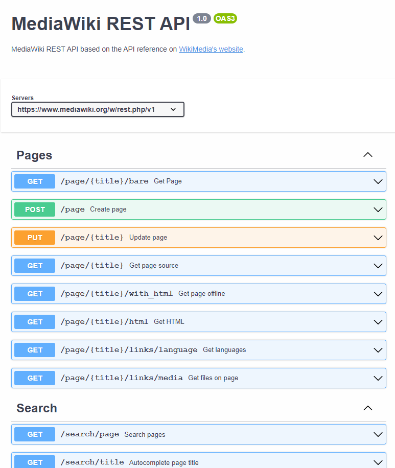
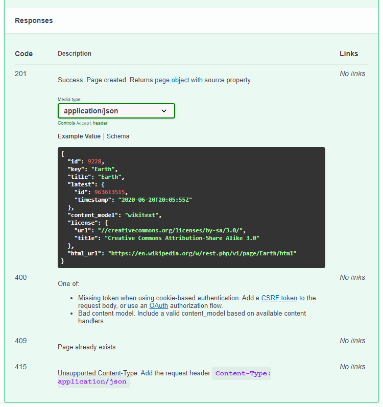

# WikiMedia REST API OpenAPI 

## Description

OpenAPI file for the MediaWiki Rest API.
The official documentation can be found on [WikiMedia's website](https://www.mediawiki.org/wiki/API:REST_API/Reference).

**Warning** : I'm new to writing OpenAPI files. There may be some errors. Also, I will not update it if the reference changes.

I needed an OpenAPI file to test some API management tools but couldn't find one, so I created this this in the hope that it will help someone else 😀.

## Overview

Every request documented in the reference is present in the file.

I tried to include as much information as possible.
Any example or description in the official API reference can be found in this project.
